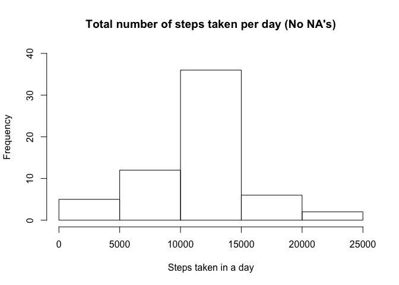
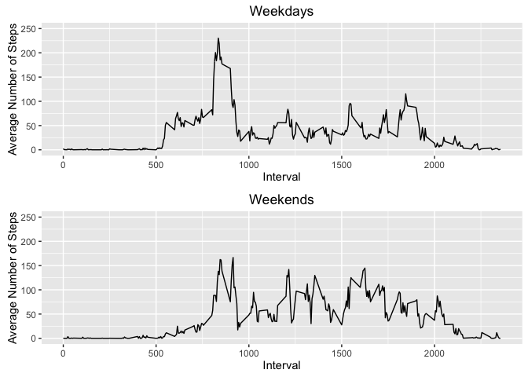

Loading and preprocessing the data
----------------------------------

### Reading in the dataset and/or processing the data

``` r
        #Loading libraries
        library(knitr)
        library(ggplot2)
        #Load the data
        temp <- tempfile()
        download.file("https://d396qusza40orc.cloudfront.net/repdata%2Fdata%2Factivity.zip",temp)
        activity<-read.csv(unz(temp,"activity.csv"),header=TRUE)
        unlink(temp)
        #Removing NAs (Process/transform the data into a format suitable for analysis)
        activityClean<-activity[complete.cases(activity),]
```

What is mean total number of steps taken per day?
-------------------------------------------------

### Histogram of the total number of steps taken each day

``` r
        #Calculate the total number of steps taken per day
        activityByDay<-aggregate(activityClean$steps,by=list(Category=activityClean$date),FUN=sum,na.rm=TRUE)
        #The height represent of the bars represents the number of days that got those steps, i.e. 13 days got from 0-500 steps
        #Histograms use continuous data where the bins represent ranges of data rather than categories. 
        hist(activityByDay$x,main="Total number of steps taken per day",xlab="Steps taken in a day",ylim = c(0,30))
```

 \#\#\#3.-Mean and median number of steps taken each day

The mean of steps taken each day is 1.076618910^{4}. The median of steps taken each day is 10765.

What is the average daily activity pattern?
===========================================

### 4.-Time series plot of the average number of steps taken

``` r
        AverageByDate<-na.omit(aggregate(list(AverageSteps=activity$steps),list(Date=activity$date),FUN=mean,na.action=NULL))
        ggplot(AverageByDate,aes(as.Date(Date,format="%Y-%m-%d"),AverageSteps,group=1))+geom_line()+ylim(0,80)+xlab("Day")+ylab("Avreage Number of Steps")
```


### 5.-Which 5-minute interval, on average across all the days in the dataset, contains the maximum number of steps?

``` r
        AverageByInterval<-aggregate(list(AverageSteps=activity$steps),list(Interval=activity$interval),FUN=mean,na.rm=TRUE)
        AverageByInterval[which.max(AverageByInterval$AverageSteps),]
```

    ##     Interval AverageSteps
    ## 104      835     206.1698

Imputing missing values
-----------------------

### 6.-Code to describe and show a strategy for imputing missing data

Calculate and report the total number of missing values in the dataset (i.e. the total number of rows with 𝙽𝙰s)

``` r
        #Number of NA's
        sum(is.na(activity))
```

    ## [1] 2304

In this case, the strategy will be to replace the NA's with the median for that 5-minute interval, the following code creates a new dataset that is equal to the original dataset but with the missing data filled in.

``` r
        activity_NoNA<-activity
        for(i in 1:nrow(activity_NoNA)){
                if(is.na(activity_NoNA$steps[i])){
                        activity_NoNA$steps[i]<-AverageByInterval[AverageByInterval$Interval==activity[i,]$interval,]$AverageSteps
                }
        }
```

### 7.Histogram of the total number of steps taken each day after missing values are imputed

``` r
        #Calculate the total number of steps taken per day
        activityByDayNoNA<-aggregate(activity_NoNA$steps,by=list(Category=activity_NoNA$date),FUN=sum,na.rm=TRUE)
        
        hist(activityByDayNoNA$x,main="Total number of steps taken per day (No NA's)",xlab="Steps taken in a day",ylim = c(0,40))
```



Calculate and report the mean and median total number of steps taken per day.

### Do these values differ from the estimates from the first part of the assignment?

There's a slightly difference in the mediam, mean does not change. The mean for both values is 1.076618910^{4}. The first median is 1.076618910^{4}. The second median is 10765.

Are there differences in activity patterns between weekdays and weekends?
=========================================================================

### 8.Panel plot comparing the average number of steps taken per 5-minute interval across weekdays and weekends

Create a new factor variable in the dataset with two levels – “weekday” and “weekend” indicating whether a given date is a weekday or weekend day.

``` r
        activity_NoNA$day<-weekdays(as.Date(activity_NoNA$date))
        activity_NoNA$daynum<-as.POSIXlt(activity_NoNA$date)$wday
        activityWeekends<-subset(activity_NoNA, daynum %in% c(6,0))
        activityWeekdays<-subset(activity_NoNA, daynum %in% c(1,2,3,4,5))
        AverageByWeekdays<-aggregate(list(AverageSteps=activityWeekdays$steps),list(Interval=activityWeekdays$interval),FUN=mean)
        AverageByWeekends<-aggregate(list(AverageSteps=activityWeekends$steps),list(Interval=activityWeekends$interval),FUN=mean)
```

Make a panel plot containing a time series plot (i.e. 𝚝𝚢𝚙𝚎 = "𝚕") of the 5-minute interval (x-axis) and the average number of steps taken, averaged across all weekday days or weekend days (y-axis).

``` r
         par(mfrow=c(2,1))
        
        library(grid)
        library(gridExtra)
        p1<-ggplot(AverageByWeekdays,aes(Interval,AverageSteps))+geom_line()+ylim(0,250)+xlab("Interval")+ylab("Average Number of Steps")+ggtitle("Weekdays")
        p2<-ggplot(AverageByWeekends,aes(Interval,AverageSteps))+geom_line()+ylim(0,250)+xlab("Interval")+ylab("Average Number of Steps")+ggtitle("Weekends")
        grid.arrange(p1,p2,ncol=1)
```


